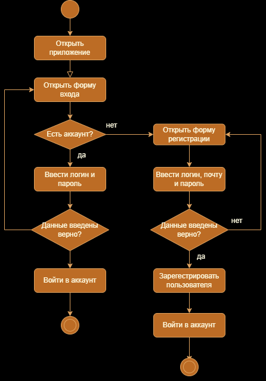
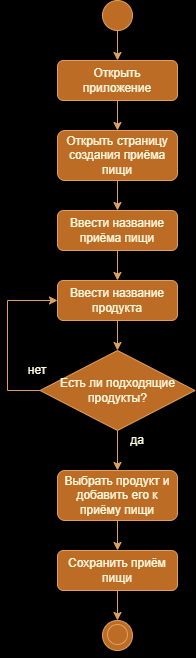
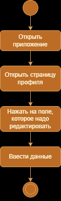

# Диаграммы активностей

## Содержание
1. [Регистрация и авторизация](#1)
2. [Добавление приёма пищи](#2)
3. [Редактирование профиля пользователя](#3)

### 1. Создание нового пользователя

### 2. Добавление приёма пищи

### 3. Редактирование профиля пользователя

