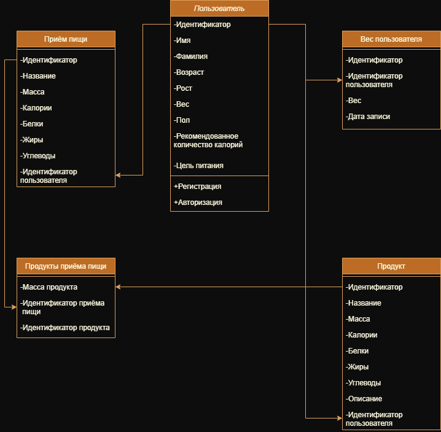

# Диаграмма классов

## Глоссарий

| Класс                 | Описание                                                                                                                                                           |
|:----------------------|:-------------------------------------------------------------------------------------------------------------------------------------------------------------------|
| Продукт               | Продукты или блюда, которые имеют определённое количество калорий, белков, жиров, углеводов при соответсвующей массе.                                                 |
| Приём пищи            | Приёмы пищи, которые имеют определённое количество калорий, белков, жиров, углеводов и массу и включают в себя продукты/блюда.                                                                                                                                                 |
| Продукты приёма пищи  | Включает в себя продукты и/или блюда приёма пищи.                                                                                 |
| Вес пользователя      | Включает в себя вес пользователя в определённый день за послдение 30 дней.                                                                             |
| Пользователь          | Лицо, зарегистрированное в системе, которое может выполнять действия, такие как авторизация или регистрация. Имеет уникальный идентификатор, логин, пароль, почту. |
